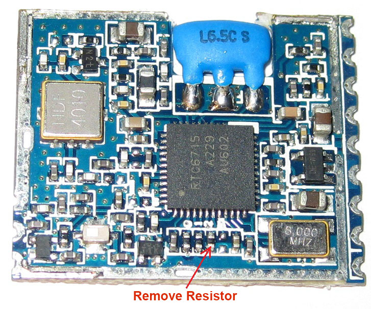
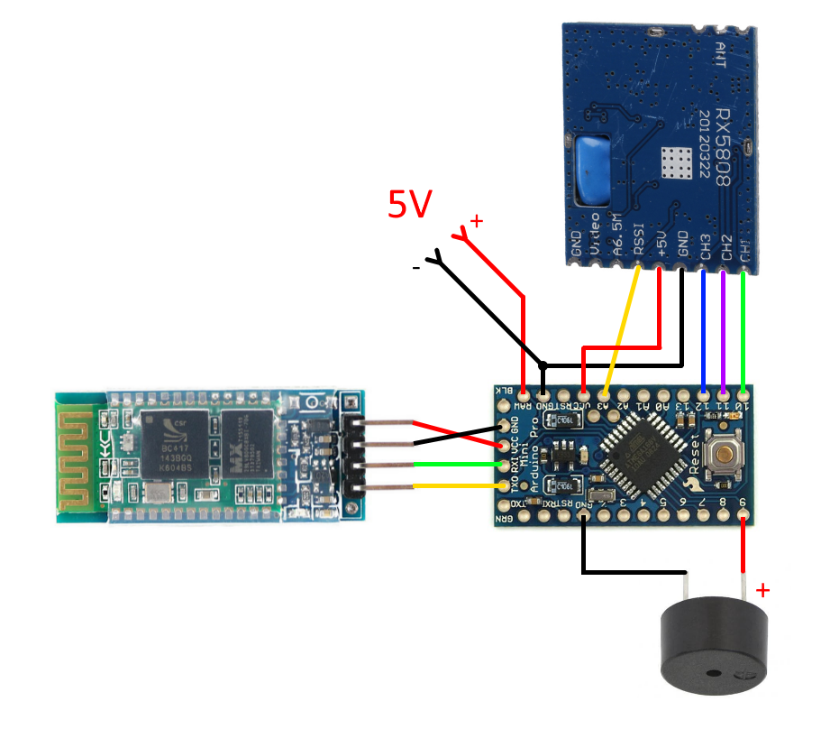
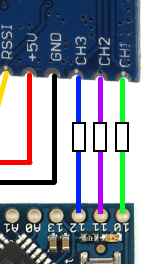
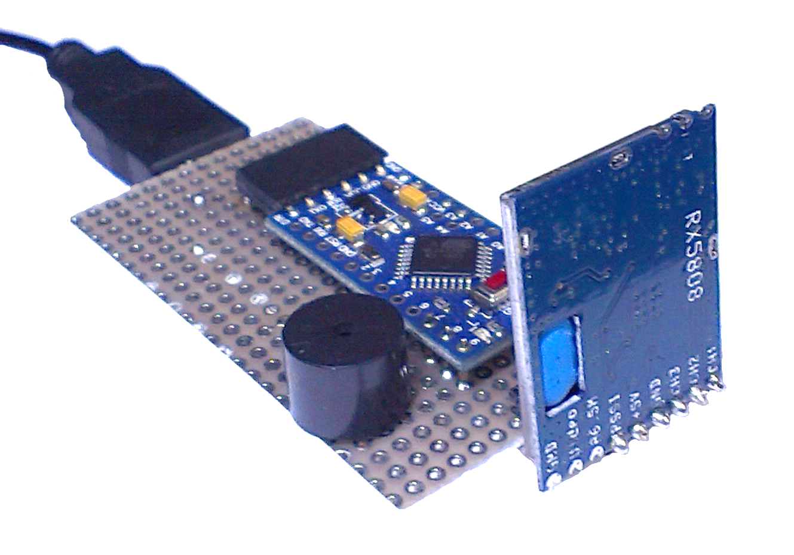
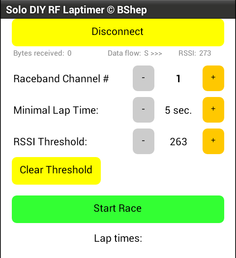
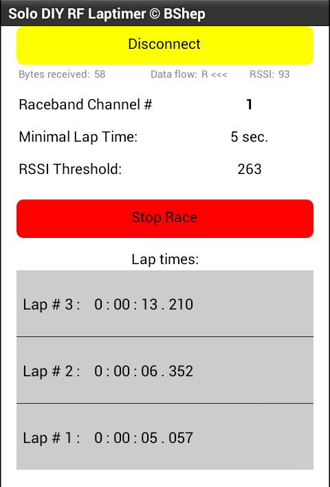
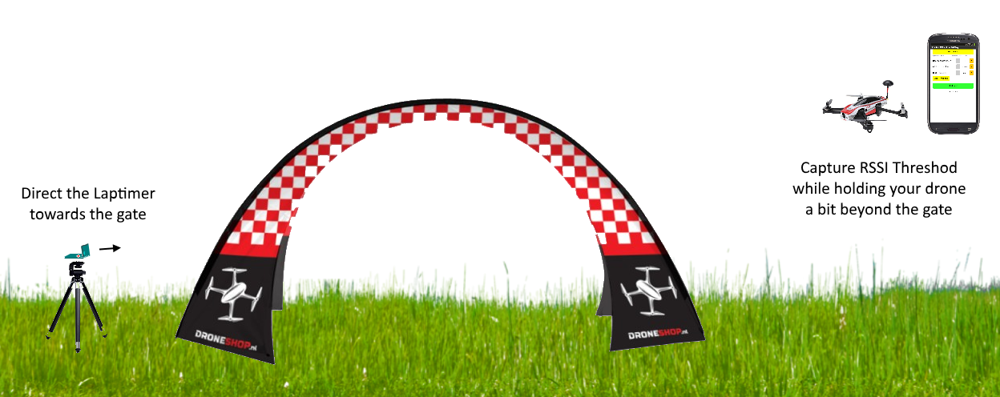

#Solo DIY RF Laptimer
DIY lap timing solution for a lonely drone racer.
When you become a seasoned drone racer, you want to know how fast you are. Using the Laptimer you can catch moments of passing the start/finish gates using just the signal of a Video Transmitter installed on your drone (no additional equipment on a drone is required).

##Features
- No additional equipment besides 5.8GHz Video Transmitter required on a drone.
- Measure lap times with 1ms resolution (in theory; need to perform live tests).
- Android application for interaction with the Laptimer via Bluetooth.
- Compatible with [EasyRaceLapTimer](https://github.com/polyvision/EasyRaceLapTimer) software v.0.6 (can act as a VTx sensor).
- 5V * 250 mA power consumption
- Low cost (around $16), compared to similar solutions available on market.

##Limitations
- Tracks up to 100 laps.
- Limited to 8 Raceband VTx channels so far (it's just a software configuration limitation - any channel from 5.8GHz range can be used with slight modification of Arduino code)
- Doesn't work with digital VTx equipment (like Connex)
- Monitors single VTx frequency, thus tracks only one drone per race. I'm already working on a Multi-tracking Laptimer solution.
- Settings and measurements data is kept on Arduino side and gets lost when the Laptimer device is powered off.
- No software for iOS yet.

##How it works
The Laptimer device measures a VTx signal strength (RSSI value) and compares it with a threshold set up. If the RSSI value is above the threshold, the drone is considered passing a finish gate.

##Hardware
Used parts:

 - RX5808 (with SPI patch)
 - Arduino Pro Mini 5V 16MHz
 - HC-06 Bluetooth module
 - Piezo buzzer (5V, without built-in generator) - optional
 - 5V power supply (for example 2-4S LiPo with 5V BEC)

###RX5808 SPI patch
(copied from [sheaivey/rx5808-pro-diversity](https://github.com/sheaivey/rx5808-pro-diversity) repo)

In order to get the RX5808 to use SPI (which is required for this project) you will need to open it and remove a single SMD resistor.

For older versions of RX5808 use [these instructions](https://github.com/markohoepken/rx5808_pro_osd/wiki/rs5808-spi-patch).

###Wiring
Wiring schematic:

It seems to work fine being connected this way, however adding 100 Ω resistors in line on SPI wires (Arduino pins 10, 11, 12) is a good idea to prevent possible glitches with channel selection:

###Assembly
Correct positioning of RX5808 module against the finish gate area is vital for correct measurements.

I tried using different types of antennas and shields with RX5808 to achieve the best possible accuracy, and finally found that the module itself may be treated as a short-range directional antenna. The non-shielded side of the module is a surface that should face the gate, so consider this fact upon assembling.

Here's how my prototype looks:

##Software
###Arduino
Download the project from Arduino folder, open **solo-diy-rf-laptimer.ino** file with Arduino IDE and upload to device.

###Android App
Download the **Solo_DIY_RF_Laptimer.apk** file from Android folder and install on your Android device or use the following QR code to download:

(Make sure to allow installation from unknown sources in your Android device settings).

####App User Guide
Application startup screen:

- **Connect**: tap to connect to Laptimer Bluetooth module.
- **Raceband Channel #**: use +/- to tune the laptimer to next/prev channel.
- **Minimal Lap Time**: use +/- to increase/decrease minimal lap time. Set enough time to let a drone leave the "above-threshold RSSI area" after lap time is captured.
- **RSSI Threshold**: use +/- to fine-tune RSSI threshold.
- **Capture Threshold**: tap to capture currently measured RSSI value as a threshold.
- **Start Race**: tap to start tracking laps.

When connected, application polls the Laptimer device each 30ms and displays current settings and measurements:

Note the **RSSI** label below the **Disconnect** button - it shows current RSSI reading, which might be useful for monitoring VTx channels or positioning the device.

Race mode:

In a Race mode you cannot change Channel, Min Lap Time or Threshold to prevent from occasional loss of the race results. Up to 100 laps can be tracked. But the more lap times are recorded, the longer it takes to retrieve the data from Laptimer to Android App. It doesn't affect the accuracy, but might introduce delays in the app performance.

When you stop the race, Laptimer device immediately clears saved lap times, but they remain visible in the application until new race is started.

##Setup and Usage Guide
 1. Power on the Laptimer device and place it on one side of the finish gate.
 2. Start the Android app and connect to the Laptimer device.
 3. Fully prepare your drone for a race and power it up (VTX must be powered in racing mode).
 4. Go a bit beyond the opposite side of the gate (normally 3-4 meters from the installed Laptimer).
 5. Capture current RSSI value as a threshold using the Android app (use "Capture Threshold" button).
 6. Start Race in the app.
 7. Fly the track and see the lap times being captured.

Also I'd consider shielding the Laptimer device with a piece of metal on one side where drones are approaching from. It might increase the accuracy by reducing the VTx signal strength before drone is inside a gate.

#Contacts
YouTube channel: https://www.youtube.com/user/voroshkov
Facebook: https://www.facebook.com/andrey.voroshkov

Feel free to ask questions, suggest improvements, report your usage results.

Happy flying!
